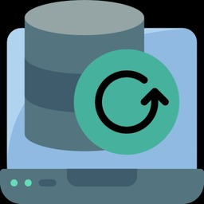

# Nigel1992 Kodi Repository

<div align="center">


[](https://github.com/Nigel1992/kodi-repository/releases/latest)
[](https://github.com/Nigel1992/kodi-repository/commits/master)
[](LICENSE)
[](https://github.com/Nigel1992/kodi-repository/stargazers)

</div>

A modern, well-structured repository for Kodi addons featuring LibreELEC utilities and more.

## 🚀 Featured Addons

### LibreELEC Backupper (v1.2.1.1)


A comprehensive backup solution for LibreELEC with these powerful features:
- Real-time progress tracking with accurate file size display
- Support for multiple storage options (Local, SMB, NFS, FTP, SFTP, WebDAV)
- Configurable compression levels for optimal backup size
- Scheduled backups with reminder notifications
- User-friendly interface with detailed status reporting

## 📥 Installation

### Quick Install (Recommended)
1. Download the [repository zip file](https://github.com/Nigel1992/kodi-repository/releases/latest)
2. In Kodi, go to Add-ons → Add-on browser (box icon) → Install from zip file
3. Select the downloaded zip file
4. Wait for the "Repository installed" notification
5. Go to Install from repository → Nigel1992 Repository → Select category → Choose addon → Install

### Manual Installation
If you prefer to manually install individual addons:
1. Browse to the desired addon in the repository
2. Download the corresponding zip file
3. Install through Kodi's "Install from zip file" option

## 🔄 Updates

Addons in this repository automatically notify you when updates are available. To update:
1. From the Kodi home screen, navigate to Add-ons
2. When updates are available, you'll see a notification
3. Select the addon and choose "Update"

## 🧰 Repository Structure

```
repository.nigel1992/
├── addons/
│   ├── repository.nigel1992/      # Repository addon itself
│   ├── service.libreelec.backupper/ # LibreELEC Backupper addon
│   ├── addons.xml                 # Addon index
│   └── addons.xml.md5             # Checksum for verification
└── scripts/                     # Repository management scripts
    ├── generate_repo.py         # Generate repo index files
    └── create_repository_zip.py # Create addon zip packages
```

## 🛠️ For Developers

This repository includes scripts for automating addon management:
- Scripts to generate proper repository structure
- GitHub Actions workflow for automatic updates
- Supports both zipped and unzipped addon formats

## 📝 License

Individual addons are licensed according to their respective license files. Repository tools are available under GPL-2.0.

## 🤝 Contributing

Contributions are welcome! If you'd like to contribute:
1. Fork the repository
2. Create a feature branch
3. Submit a pull request

## 📞 Support

For support, please file an issue on the GitHub repository or contact through the Kodi forums.
